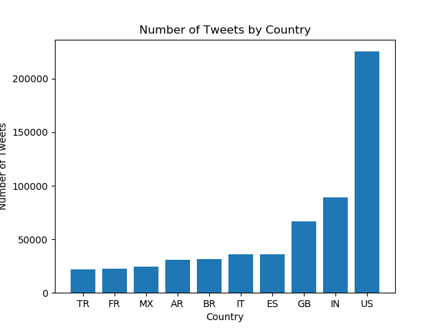

# Coronavirus twitter analysis

You will scan all geotagged tweets sent in 2020 to monitor for the spread of the coronavirus on social media.

**Learning Objectives:**

1. work with large scale datasets
1. work with multilingual text
1. use the MapReduce divide-and-conquer paradigm to create parallel code

## Background

**About the Data:**

Approximately 500 million tweets are sent everyday.
Of those tweets, about 2% are *geotagged*.
That is, the user's device includes location information about where the tweets were sent from.
The lambda server's `/data/Twitter dataset` folder contains all geotagged tweets that were sent in 2020.
In total, there are about 1.1 billion tweets in this dataset.

The tweets are stored as follows.
The tweets for each day are stored in a zip file `geoTwitterYY-MM-DD.zip`,
and inside this zip file are 24 text files, one for each hour of the day.
Each text file contains a single tweet per line in JSON format.
JSON is a popular format for storing data that is closely related to python dictionaries.

