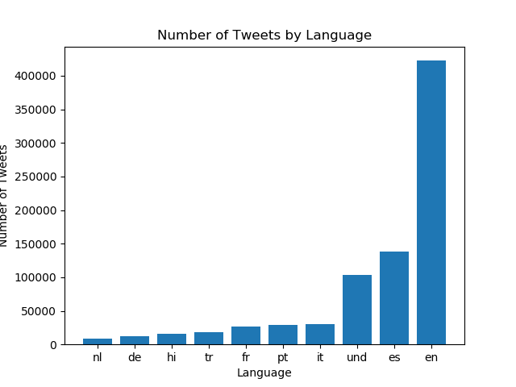
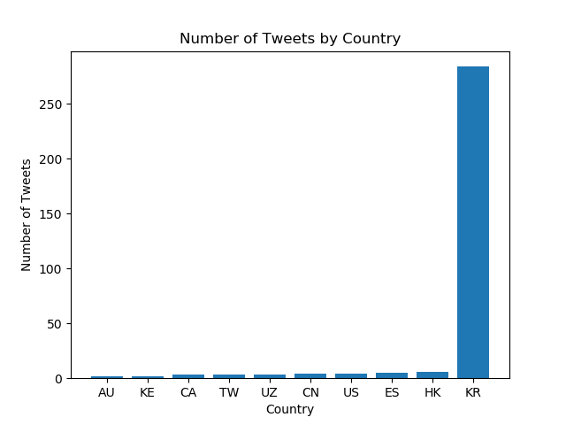
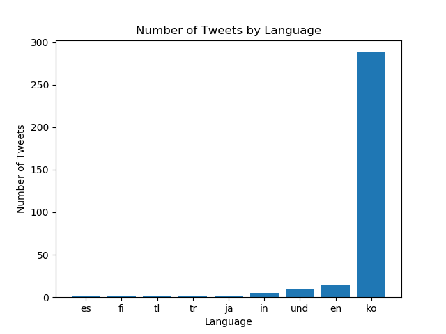
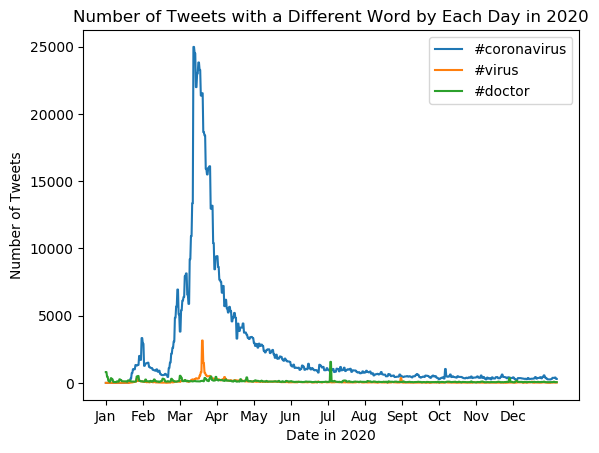

# Coronavirus twitter analysis

In this repository I scanned all geotagged tweets sent in 2020 to monitor for the spread of the coronavirus on Twitter. About 2% of all tweets are geotagged everyday. I am working with about 1.1 billion tweets in this database. I learned how to work with large scale datasets effectively. I also worked with multilingual text such as English and Korean in my analysis. I used shell the vim environment and of course python to successfully generate 4 png graphs. I also learned to use the MapReduce divide and conquer paradigm to create parallel code. In this project I demonstrated how to filter, reduce and visualize large datasets into easy visuals like the graphs below!

**Learning Objectives:**

1. work with large scale datasets
1. work with multilingual text
1. use the MapReduce divide-and-conquer paradigm to create parallel code

